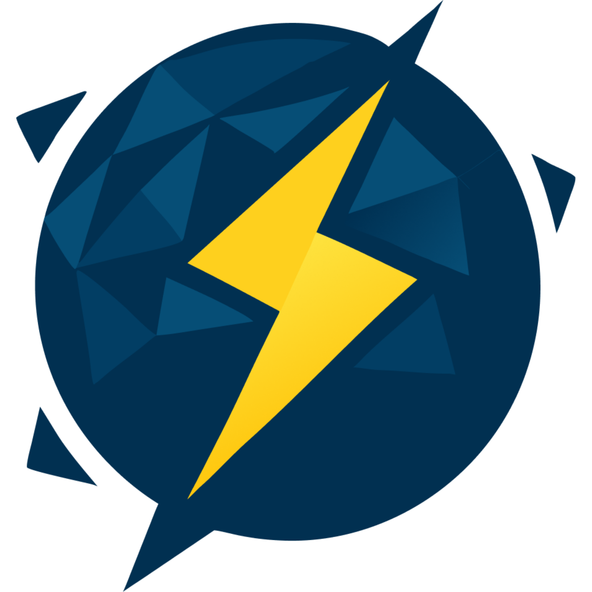

<div align="center">
  

  <h1>Escape Room Psicológico</h1>

  <p><strong>Un proyecto de SPARK</strong></p>
  <p><em>Conversaciones guiadas con IA para anamnesis psicológica estructurada</em></p>
</div>

---

## 👋 Bienvenido al equipo

Primero, gracias por sumarte. Esto no es un tutorial ni un curso — es un proyecto **real**, que vamos a construir de principio a fin, y que va directo a tu portafolio profesional.

En las próximas semanas vas a tocar auth real, integración con LLMs, streaming en tiempo real, base de datos relacional, y deploy en producción. Al terminar, vas a tener algo que muchos desarrolladores con varios años de experiencia no tienen en su CV.

Ya lo dije en la reunión y lo repito aquí: **lo que importa no es que el producto salga perfecto. Lo que importa es que en unas semanas cada uno sea un mejor ingeniero del que empezó.**

---

## 🧠 ¿Qué estamos construyendo?

Una plataforma donde **psicólogos** diseñan conversaciones guiadas por IA, y **usuarios** las completan de forma asíncrona. Al terminar, el psicólogo recibe la transcripción completa más un análisis automático de la sesión.

### Casos de uso

- **Antes de la primera cita** — el paciente completa la conversación antes de su primera consulta, y el psicólogo llega con contexto.
- **Entre sesiones** — pacientes en terapia activa responden periódicamente, y el psicólogo ve patrones a lo largo del tiempo.
- **Autoexploración** — personas que quieren entender qué sienten antes de decidir ir a terapia.

---

## 🛠 Stack

Capa             Tecnología 
Frontend         React + Vite, hospedado en **Vercel** 
Backend          Node.js + Express, hospedado en **Railway** 
Base de datos    **PostgreSQL** (Railway) 
Auth             **JWT + bcrypt** (implementación propia) 
LLM              **GEMINI API** (Google) 

---

## 🌿 Sobre este repositorio

Esta es la rama de **producción** (`main`). Todo lo que vive acá es el código que termina desplegado.

Vas a ser agregado como **colaborador** del repo en GitHub. Eso significa una cosa importante:

>  **No necesitas hacer fork.**
>  **Clonas el repo directamente y trabajas en tu propia rama.**

El fork solo aplica cuando alguien externo quiere contribuir. Como parte del equipo, trabajas directo sobre este repositorio.

---

## 🚀 Cómo empezar

### 1. Clona el repositorio

```bash
git clone https://github.com/IniciativaSPARK/Proyecto-Escape-Room-Emocional.git
cd Proyecto-Escape-Room-Emocional
```

### 2. Crea tu propia rama

**Nunca trabajes directo en `main`.** Crea una rama con tu nombre y lo que vas a hacer:

```bash
git checkout -b feature/[tu-nombre]-[area]
```

Ejemplos:

```bash
git checkout -b feature/juan-auth
git checkout -b feature/maria-chat-engine
git checkout -b feature/carlos-dashboard
```

### 3. Trabaja, commitea y sube tu rama

Usa prefijos claros en tus commits:

```bash
git add .
git commit -m "feat: agregar login con JWT"
git push origin feature/tu-rama
```

**Prefijos de commit:**

- `feat:` nueva funcionalidad
- `fix:` corrección de bug
- `refactor:` mejora sin cambiar comportamiento
- `docs:` cambios en documentación
- `chore:` mantenimiento, configuración

### 4. Abre un Pull Request hacia `main`

Cuando termines una feature o quieras que revise tu avance:

1. Abre un PR desde tu rama hacia `main`.
2. Describe qué hiciste y por qué.
3. Asigname como reviewer.
4. Yo reviso, damos feedback, y hacemos merge juntos.

> ⚠️ **Todo PR se revisa antes del merge. Sin excepciones.**

---

## 📏 Reglas no negociables

1. **`main` es producción.** No se commitea nada directo. Nunca.
2. **Todo PR pasa por revisión** antes de hacer merge.
3. **Cero secretos en el repo.** API keys, contraseñas, tokens — todo va en `.env` (incluido en `.gitignore`).
4. **Commits claros.** Usa los prefijos listados arriba.
5. **Si estás atascado más de 45 minutos, pregunta.** Perder una tarde entera peleando solo no sirve a nadie.

---

## 💬 Comunicación

- **Dudas rápidas, bloqueos, preguntas de implementación** → Grupo de WhatsApp del equipo
- **Discusiones técnicas largas** → Comentarios en el PR o Issues de GitHub
- **Reuniones del equipo** → Calendario compartido

Cualquier duda, por mínima que parezca, escríbela en el WhatsApp. Prefiero responder 20 preguntas "tontas" a que pierdas un día entero atorado.

---

## 📚 Recursos útiles

- [Documentación de GEMINI API](https://ai.google.dev/gemini-api/docs?hl=en)
- [React](https://react.dev/) · [Vite](https://vitejs.dev/)
- [Express](https://expressjs.com/)
- [PostgreSQL](https://www.postgresql.org/docs/)
- [Conventional Commits](https://www.conventionalcommits.org/)

---

## 💻 Levantar el proyecto en local

El repo está dividido en dos carpetas independientes: `Backend/` y `Frontend/`. Cada una tiene su propio `package.json` y sus propias dependencias.

### Backend

```bash
cd Backend
npm i
```

> 🚧 **Todavía no hay servidor implementado.** Solo instala las dependencias por ahora. Cuando empecemos a construir las rutas y el `index.js`, actualizo esta sección con el comando para levantarlo.

### Frontend

```bash
cd Frontend
npm i
npm run dev
```

Con esto se levanta Vite en `http://localhost:5173` y deberías ver la pantalla de bienvenida de SPARK. Si la ves, estás listo para empezar.

---

<div align="center">
  
  <br/>
  <sub><strong>SPARK</strong> · Escape Room Psicológico</sub>
</div>
